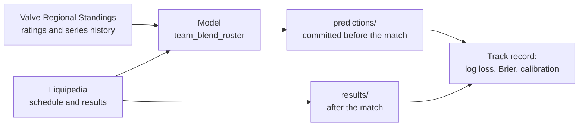

<div align="center">

# I.C.S.Y. — public forecast journal

**Calibrated pre-match forecasts for professional Counter-Strike 2, published before every match and checked against the results.**

[](https://github.com/hoxitoo/I.C.S.Y-predictions/actions/workflows/publish.yml)
[](LICENSE)


**English** · [Русский](README.ru.md)

</div>

> [!IMPORTANT]
> This is an analytics and research project. **It is not betting advice**, it shows no odds and it is not affiliated with any bookmaker, with Valve, HLTV or Liquipedia. A forecast of 60% is expected to be wrong in about 4 cases out of 10: that is what a calibrated forecast means.

## What this is

I.C.S.Y. (*I Can See You*) forecasts upcoming professional CS2 matches and says how far each number can be trusted. This repository is its **public track record**:

- every forecast is committed here **before the match starts**;
- results are recorded automatically after the match;
- nothing is ever edited or deleted: a re-forecast is a new line that points to the old one.

Anyone can check the accuracy and calibration from the files alone: no account, no API, no trust in the author required.

## What is published now

| | |
|---|---|
| **Forecast** | Probability that each team wins the series (`series_winner`) |
| **Matches** | Upcoming matches listed on Liquipedia where at least one team is in the top 70 of any Valve Regional Standings ranking (global, Europe, Americas, Asia). Both teams need at least 5 series in the last 180 days |
| **Not forecast** | Bo2 series (they can end 1:1), matches with an unknown opponent, teams without ranked history |
| **Model** | `team_blend_roster` 0.1.0, details [below](#current-model) |
| **Schedule** | Twice a day, 05:17 and 17:17 UTC. A match is usually forecast days ahead, as soon as both teams are known |
| **Coming next** | Map and player forecasts (kills, deaths, ADR with intervals), weekly calibration reports, Telegram channels in English and Russian |

## How it works



The [publish workflow](.github/workflows/publish.yml) runs on a schedule:

1. collect fresh data;
2. record the results of finished matches;
3. forecast new upcoming matches;
4. commit and push.

Every commit is made by a public workflow run with its own timestamped log on GitHub. That, not the author's word, is the proof that a forecast existed before the match.

## Repository layout

| Path | Contents |
|---|---|
| [`predictions/YYYY-MM-DD.jsonl`](predictions/) | Forecasts created that day (UTC), one JSON object per line |
| [`results/YYYY-MM-DD.jsonl`](results/) | Match outcomes recorded that day |
| `reports/` | Weekly calibration reports (coming) |

## Journal rules

1. **Append-only.** Lines are never changed or removed. History is protected from force-pushes.
2. **Before the match.** A forecast counts only if its `created_at` is earlier than the **actual** start of the match, taken from the result record. Scheduled times often move: a match planned for 11:00 may start at 11:25.
3. **Re-forecasts** keep the same `match_id` and point to the previous line through `supersedes`. The track record uses the last forecast made before the start and is also reported for the first one, so re-forecasts cannot improve the record after the fact.
4. **Corrections** of data errors are new lines with `correction_of` and `reason`. The original stays visible.
5. **Every line names its model version and parameters.** The track record is reported per version and overall.
6. **Not scored:** forfeits and draws. They are still recorded in `results/`.

## Record format

<details>
<summary><b>Forecast</b> (<code>predictions/*.jsonl</code>), example with illustrative numbers</summary>

```json
{
  "prediction_id": "20261009T171700Z-1f0c3a9e5b7d2c41",
  "created_at": "2026-10-09T17:17:00+00:00",
  "schema_version": "0.2",
  "model": {"name": "team_blend_roster", "version": "0.1.0",
            "params": {"roster_elo_k": 64.0, "vrs_scale": 0.42, "blend_roster_prev_lineup_weight_elo": 0.65}},
  "match": {
    "match_id": "1f0c3a9e5b7d2c41",
    "source": "liquipedia",
    "start_time": "2026-10-10T13:45:00+00:00",
    "event": "ESL Pro League Season 24 - Playoffs",
    "event_page": "ESL/Pro League/Season 24",
    "stage": "Playoffs",
    "format": "bo3",
    "team_a": {"title": "Team Vitality", "name": "Vitality", "vrs_name": "vitality", "vrs_global_rank": 1, "lineup": ["..."]},
    "team_b": {"title": "Aurora Gaming", "name": "Aurora", "vrs_name": "aurora", "vrs_global_rank": 9, "lineup": ["..."]}
  },
  "target": {"type": "series_winner", "map": null, "player": null},
  "forecast": {"p_team_a": 0.61},
  "interval": null,
  "confidence": {"index": 82, "reasons": [{"code": "series_180d_min", "value": 41}]},
  "scope_tier": "global_top30",
  "attribution": ["Valve Regional Standings (event data: HLTV.org)", "Liquipedia (CC BY-SA 3.0), https://liquipedia.net/counterstrike/"],
  "supersedes": null,
  "correction_of": null,
  "reason": null
}
```

</details>

<details>
<summary><b>Result</b> (<code>results/*.jsonl</code>)</summary>

```json
{
  "schema_version": "0.2",
  "match_id": "1f0c3a9e5b7d2c41",
  "settled_at": "2026-10-10T17:17:00+00:00",
  "source": "liquipedia",
  "start_time": "2026-10-10T14:10:00+00:00",
  "teams": {"team_a": "Team Vitality", "team_b": "Aurora Gaming"},
  "outcome": {"winner": "team_a", "score": "2:1", "forfeit": false},
  "source_fetched_at": "2026-10-10T17:16:41+00:00",
  "attribution": ["Liquipedia (CC BY-SA 3.0), https://liquipedia.net/counterstrike/"]
}
```

</details>

| Field | Meaning |
|---|---|
| `match_id` | Journal ID of the match. Liquipedia has no stable match ID, so it is issued at the first forecast and later sightings are linked by tournament, stage, both teams and a start time within 3 days |
| `start_time` | In a forecast: the scheduled start. In a result: the actual start |
| `team_a.title` | Liquipedia page of the team. Results are matched by title, so the order in which a source lists the teams does not matter |
| `forecast.p_team_a` | Probability that `team_a` wins the series |
| `confidence.index` | Reliability index 0–100. **Version 0, not yet validated:** data volume 50%, line-up stability 30%, rating data available 20%; capped at 90 until it is checked against outcomes |
| `scope_tier` | Coverage tier for separate calibration: `global_top30`, `global_31_70`, `regional` |
| `outcome.winner` | `team_a`, `team_b` or `draw`, in the order given by `teams` |

## Check it yourself

The commit history shows when every line was added:

```bash
git log --format="%cI %h %s" -- predictions/
```

Recompute the track record with plain Python 3.11+, no packages needed:

```python
import json, math, pathlib
from datetime import datetime

def load(folder):
    for path in sorted(pathlib.Path(folder).glob("*.jsonl")):
        for line in path.read_text(encoding="utf-8").splitlines():
            if line.strip():
                yield json.loads(line)

forecasts = {}
for p in load("predictions"):
    if p["target"]["type"] == "series_winner":
        forecasts.setdefault(p["match"]["match_id"], []).append(p)

scored = []
for r in load("results"):
    o = r["outcome"]
    if o["forfeit"] or o["winner"] not in ("team_a", "team_b"):
        continue  # forfeits and draws are not scored
    start = datetime.fromisoformat(r["start_time"])
    valid = [p for p in forecasts.get(r["match_id"], [])
             if datetime.fromisoformat(p["created_at"]) < start]
    if valid:
        p = valid[-1]  # the last forecast made before the match started
        won = p["match"]["team_a"]["title"] == r["teams"][o["winner"]]
        scored.append((p["forecast"]["p_team_a"], won))

n = len(scored)
if n:
    log_loss = -sum(math.log(q if won else 1 - q) for q, won in scored) / n
    brier = sum((q - won) ** 2 for q, won in scored) / n
    picked = sum((q > 0.5) == won for q, won in scored) / n
    print(f"{n} series · log loss {log_loss:.4f} · Brier {brier:.4f} · winners picked {picked:.1%}")
```

For reference, a coin flip scores a log loss of 0.6931 and a Brier score of 0.25.

## Current model

`team_blend_roster` 0.1.0 combines two signals:

- **Roster-aware Elo.** Ratings belong to players, not to team names. A team's strength is the average rating of its five players, a newcomer starts at the level of their new teammates, and a player keeps their rating after a transfer. Line-up changes are the norm: in 79% of series at least one team had changed players in the previous 30 days. The forecast uses each team's last known line-up, so a stand-in announced on match day is not seen.
- **Valve Regional Standings points,** calibrated: Valve's own formula is overconfident and loses to a coin flip on log loss until its logit is scaled down.

Parameters were tuned on series up to 30.06.2025 and frozen; they change only with a new model version. Out-of-sample check on Valve's series history, 01.07.2025–30.06.2026 (8,426 series):

| Model | Log loss | Brier | Calibration error (ECE) | Winners picked |
|---|---|---|---|---|
| Coin flip | 0.6931 | 0.2500 | — | 50.0% |
| Valve VRS formula, as published | 0.6990 | 0.2434 | 0.103 | 61.1% |
| Elo by team name | 0.6285 | 0.2194 | 0.022 | 64.2% |
| **team_blend_roster 0.1.0** | **0.6090** | **0.2105** | **0.017** | **67.0%** |

Matches between two top-30 teams are much harder: about **62%** of winners picked there. Expect numbers in that range for the most visible matches. The public track record in this repository is the real test.

## Sources and attribution

- **[Liquipedia](https://liquipedia.net/counterstrike/)** — schedule, teams and results, licensed under [CC BY-SA 3.0](https://creativecommons.org/licenses/by-sa/3.0/). Data is read through the public MediaWiki API within its rate limits.
- **[Valve Regional Standings](https://github.com/ValveSoftware/counter-strike_regional_standings)** — rankings, points and series history with line-ups. Event data in it is provided to Valve by HLTV.org.

Every record names its sources in `attribution`. Raw source data is not republished here.

## License

The journal (everything in `predictions/`, `results/` and `reports/`) is licensed under [Creative Commons Attribution-ShareAlike 4.0](LICENSE). You may share and adapt it, including commercially, if you credit **I.C.S.Y. (github.com/hoxitoo/I.C.S.Y-predictions)** and the sources above and release adaptations under the same license.
