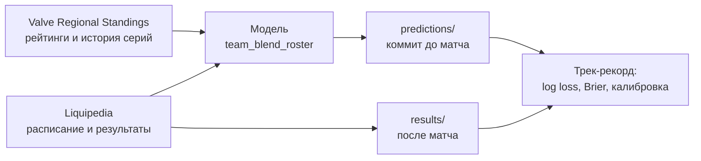

<div align="center">

# I.C.S.Y. — публичный журнал прогнозов

**Откалиброванные прогнозы на матчи профессионального Counter-Strike 2. Публикуются до начала каждого матча и сверяются с результатом.**

[](https://github.com/hoxitoo/I.C.S.Y-predictions/actions/workflows/publish.yml)
[](LICENSE)


[English](README.md) · **Русский**

</div>

> [!IMPORTANT]
> Это аналитический и исследовательский проект. **Это не советы по ставкам:** здесь нет коэффициентов, и проект не связан ни с букмекерами, ни с Valve, HLTV или Liquipedia. Прогноз 60% должен не сбываться примерно в 4 случаях из 10. Именно это и значит «откалиброванный».

## Что это

I.C.S.Y. (*I Can See You*) прогнозирует предстоящие матчи профессионального CS2 и показывает, насколько можно доверять каждой цифре. Этот репозиторий — его **публичный трек-рекорд**:

- каждый прогноз коммитится сюда **до начала матча**;
- после матча результат записывается автоматически;
- ничего не правится и не удаляется: пересчёт — это новая строка со ссылкой на старую.

Точность и калибровку может проверить любой, по одним только файлам: без аккаунта, без API и без доверия к автору.

## Что публикуется сейчас

| | |
|---|---|
| **Прогноз** | Вероятность победы каждой команды в серии (`series_winner`) |
| **Матчи** | Предстоящие матчи с Liquipedia, где хотя бы одна команда входит в топ-70 любого рейтинга Valve Regional Standings (глобальный, Европа, Америка, Азия). У обеих команд должно быть не меньше 5 серий за последние 180 дней |
| **Не прогнозируются** | Серии Bo2 (возможна ничья 1:1), матчи с неизвестным соперником, команды без рейтинговой истории |
| **Модель** | `team_blend_roster` 0.1.0, подробнее [ниже](#текущая-модель) |
| **Расписание** | Дважды в день, в 05:17 и 17:17 UTC. Обычно матч прогнозируется за несколько дней, как только известны обе команды |
| **Дальше** | Прогнозы на карты и по игрокам (убийства, смерти, ADR с интервалами), еженедельные отчёты о калибровке, Telegram-каналы на русском и английском |

## Как это работает



[Workflow публикации](.github/workflows/publish.yml) работает по расписанию:

1. собирает свежие данные;
2. записывает результаты сыгранных матчей;
3. прогнозирует новые предстоящие матчи;
4. делает коммит и пуш.

Каждый коммит делает публичный запуск workflow со своим логом и временем на GitHub. Доказательство того, что прогноз появился до матча, — это он, а не слова автора.

## Что где лежит

| Путь | Содержимое |
|---|---|
| [`predictions/YYYY-MM-DD.jsonl`](predictions/) | Прогнозы, созданные в этот день (UTC), один JSON-объект на строку |
| [`results/YYYY-MM-DD.jsonl`](results/) | Исходы матчей, записанные в этот день |
| `reports/` | Еженедельные отчёты о калибровке (скоро) |

## Правила журнала

1. **Только дописываем.** Строки никогда не меняются и не удаляются. История защищена от перезаписи (force-push).
2. **До матча.** Прогноз засчитывается, только если его `created_at` раньше **фактического** начала матча, которое берётся из записи результата. Плановое время часто сдвигается: матч на 11:00 может начаться в 11:25.
3. **Пересчёт** сохраняет тот же `match_id` и ссылается на прошлую строку через `supersedes`. В трек-рекорд идёт последний прогноз, сделанный до начала. Метрики считаются и по первому прогнозу, чтобы пересчёты не улучшали картину задним числом.
4. **Исправление** ошибки данных — новая строка с `correction_of` и `reason`. Исходная строка остаётся видимой.
5. **В каждой строке указаны версия модели и её параметры.** Трек-рекорд считается по версиям и в целом.
6. **Не оцениваются:** технические поражения и ничьи. В `results/` они всё равно записываются.

## Формат записей

<details>
<summary><b>Прогноз</b> (<code>predictions/*.jsonl</code>), пример с условными цифрами</summary>

```json
{
  "prediction_id": "20261009T171700Z-1f0c3a9e5b7d2c41",
  "created_at": "2026-10-09T17:17:00+00:00",
  "schema_version": "0.2",
  "model": {"name": "team_blend_roster", "version": "0.1.0",
            "params": {"roster_elo_k": 64.0, "vrs_scale": 0.42, "blend_roster_prev_lineup_weight_elo": 0.65}},
  "match": {
    "match_id": "1f0c3a9e5b7d2c41",
    "source": "liquipedia",
    "start_time": "2026-10-10T13:45:00+00:00",
    "event": "ESL Pro League Season 24 - Playoffs",
    "event_page": "ESL/Pro League/Season 24",
    "stage": "Playoffs",
    "format": "bo3",
    "team_a": {"title": "Team Vitality", "name": "Vitality", "vrs_name": "vitality", "vrs_global_rank": 1, "lineup": ["..."]},
    "team_b": {"title": "Aurora Gaming", "name": "Aurora", "vrs_name": "aurora", "vrs_global_rank": 9, "lineup": ["..."]}
  },
  "target": {"type": "series_winner", "map": null, "player": null},
  "forecast": {"p_team_a": 0.61},
  "interval": null,
  "confidence": {"index": 82, "reasons": [{"code": "series_180d_min", "value": 41}]},
  "scope_tier": "global_top30",
  "attribution": ["Valve Regional Standings (event data: HLTV.org)", "Liquipedia (CC BY-SA 3.0), https://liquipedia.net/counterstrike/"],
  "supersedes": null,
  "correction_of": null,
  "reason": null
}
```

</details>

<details>
<summary><b>Результат</b> (<code>results/*.jsonl</code>)</summary>

```json
{
  "schema_version": "0.2",
  "match_id": "1f0c3a9e5b7d2c41",
  "settled_at": "2026-10-10T17:17:00+00:00",
  "source": "liquipedia",
  "start_time": "2026-10-10T14:10:00+00:00",
  "teams": {"team_a": "Team Vitality", "team_b": "Aurora Gaming"},
  "outcome": {"winner": "team_a", "score": "2:1", "forfeit": false},
  "source_fetched_at": "2026-10-10T17:16:41+00:00",
  "attribution": ["Liquipedia (CC BY-SA 3.0), https://liquipedia.net/counterstrike/"]
}
```

</details>

| Поле | Значение |
|---|---|
| `match_id` | ID матча в журнале. У Liquipedia нет стабильного ID матча, поэтому он выдаётся при первом прогнозе. Следующие появления матча связываются с ним по турниру, стадии, обеим командам и времени начала в пределах 3 дней |
| `start_time` | В прогнозе — плановое начало, в результате — фактическое |
| `team_a.title` | Страница команды на Liquipedia. Результаты сверяются по названию, поэтому порядок, в котором источник перечисляет команды, не важен |
| `forecast.p_team_a` | Вероятность, что `team_a` выиграет серию |
| `confidence.index` | Индекс надёжности 0–100. **Версия 0, ещё не проверена:** объём данных 50%, стабильность состава 30%, наличие рейтинговых данных 20%. Ограничен 90, пока не проверен на исходах |
| `scope_tier` | Уровень охвата для раздельной калибровки: `global_top30`, `global_31_70`, `regional` |
| `outcome.winner` | `team_a`, `team_b` или `draw` — в порядке, заданном `teams` |

## Проверьте сами

История коммитов показывает, когда добавлена каждая строка:

```bash
git log --format="%cI %h %s" -- predictions/
```

Пересчитать трек-рекорд можно на чистом Python 3.11+, без пакетов:

```python
import json, math, pathlib
from datetime import datetime

def load(folder):
    for path in sorted(pathlib.Path(folder).glob("*.jsonl")):
        for line in path.read_text(encoding="utf-8").splitlines():
            if line.strip():
                yield json.loads(line)

forecasts = {}
for p in load("predictions"):
    if p["target"]["type"] == "series_winner":
        forecasts.setdefault(p["match"]["match_id"], []).append(p)

scored = []
for r in load("results"):
    o = r["outcome"]
    if o["forfeit"] or o["winner"] not in ("team_a", "team_b"):
        continue  # технические поражения и ничьи не оцениваются
    start = datetime.fromisoformat(r["start_time"])
    valid = [p for p in forecasts.get(r["match_id"], [])
             if datetime.fromisoformat(p["created_at"]) < start]
    if valid:
        p = valid[-1]  # последний прогноз, сделанный до начала матча
        won = p["match"]["team_a"]["title"] == r["teams"][o["winner"]]
        scored.append((p["forecast"]["p_team_a"], won))

n = len(scored)
if n:
    log_loss = -sum(math.log(q if won else 1 - q) for q, won in scored) / n
    brier = sum((q - won) ** 2 for q, won in scored) / n
    picked = sum((q > 0.5) == won for q, won in scored) / n
    print(f"{n} series · log loss {log_loss:.4f} · Brier {brier:.4f} · winners picked {picked:.1%}")
```

Для сравнения: у подбрасывания монетки log loss 0.6931, Brier 0.25.

## Текущая модель

`team_blend_roster` 0.1.0 объединяет два сигнала:

- **Elo с учётом составов.** Рейтинг принадлежит игрокам, а не названию команды. Сила команды — средний рейтинг её пяти игроков, новичок стартует на уровне новых тиммейтов, а игрок сохраняет рейтинг после перехода. Смены составов — норма: в 79% серий хотя бы одна команда меняла игроков за предыдущие 30 дней. Прогноз строится по последнему известному составу, поэтому стендин, объявленный в день матча, модель не видит.
- **Очки Valve Regional Standings** после калибровки. Формула Valve слишком самоуверенна: пока её логит не сжат, по log loss она проигрывает монетке.

Параметры подобраны на сериях до 30.06.2025 и заморожены. Они меняются только вместе с новой версией модели. Проверка вне выборки на истории серий Valve, 01.07.2025–30.06.2026 (8 426 серий):

| Модель | Log loss | Brier | Ошибка калибровки (ECE) | Угадано победителей |
|---|---|---|---|---|
| Монетка | 0.6931 | 0.2500 | — | 50.0% |
| Формула Valve VRS как есть | 0.6990 | 0.2434 | 0.103 | 61.1% |
| Elo по названию команды | 0.6285 | 0.2194 | 0.022 | 64.2% |
| **team_blend_roster 0.1.0** | **0.6090** | **0.2105** | **0.017** | **67.0%** |

Матчи двух команд из топ-30 заметно сложнее: там угадывается около **62%** победителей. Для самых заметных матчей ориентируйтесь на этот уровень. Настоящая проверка — публичный трек-рекорд в этом репозитории.

## Источники и атрибуция

- **[Liquipedia](https://liquipedia.net/counterstrike/)** — расписание, команды и результаты, лицензия [CC BY-SA 3.0](https://creativecommons.org/licenses/by-sa/3.0/). Данные берутся через публичный MediaWiki API в пределах его лимитов.
- **[Valve Regional Standings](https://github.com/ValveSoftware/counter-strike_regional_standings)** — рейтинги, очки и история серий с составами. Данные о событиях в нём Valve получает от HLTV.org.

Каждая запись указывает свои источники в поле `attribution`. Сырые данные источников здесь не перепубликуются.

## Лицензия

Журнал (всё в `predictions/`, `results/` и `reports/`) распространяется по лицензии [Creative Commons Attribution-ShareAlike 4.0](LICENSE). Его можно распространять и переделывать, в том числе в коммерческих целях, если указать **I.C.S.Y. (github.com/hoxitoo/I.C.S.Y-predictions)** и источники выше, а переработку выпускать под той же лицензией.
